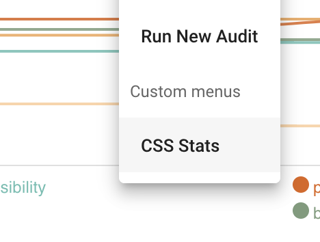

# Config
Most config should be in `/config/dashboard.js`or `/config/server.js` whether it is backend or UI

## `DATE_FORMAT:string`

## `DASHBOARD:object`
Defines in which format the timestamps of the reports will be formatted to

### `DASHBOARD:object`
This is a configobject describing the charts used on the pagess

#### `DASHBOARD.TITLE:string`
Describes the app title

#### `DASHBOARD.UPDATE_INTERVAL:number`
Define the interval in which the charts will be updated (long polling)

#### `DASHBOARD.PAGE_DASHBOARD`
Some basics about the dashboard page.

#### `DASHBOARD.PAGE_DASHBOARD.IS_FLUID:boolean`
Define if the layout is fluid or has a fixed width.

#### `DASHBOARD.PAGE_DASHBOARD.CHARTS:string[]`
Define which charts should be visible in the dashboard and in which order

Example:

    CHARTS: [
        'favorite-projects-comparison',
        'latest-audits',
        'favorite-projects-overview',
    ],

#### `DASHBOARD.PAGE_PROJECTS:object`
Set the configuration for the `/projects` page where you see all projects

##### `DASHBOARD.PAGE_PROJECTS.IS_FLUID:boolean`
Define if the layout is fluid or has a fixed width.

##### `DASHBOARD.PAGE_PROJECTS.colSize:number`
Define how many charts should be visible per row

#### `DASHBOARD.SITE_OVERVIEW_CHART`
Config on how the overview page should behave and look like

##### `DASHBOARD.SITE_OVERVIEW_CHART.fields:string[]`
Define one or more fields to be visible. See `Available fields` below

#### `DASHBOARD.latestAudits:object`
This is the config the the chart section which shows the latest audits. Regardless if you have them as favorites or not

##### `DASHBOARD.latestAudits.colSize:number`
Define how many charts should be visible per row

##### `DASHBOARD.latestAudits.limit:number`
Limit the total amount of charts

##### `DASHBOARD.latestAudits.fields:string[]`
Define one or more fields to be visible. See `Available fields` below

#### `DASHBOARD.favoriteProjectsComparison:object`
This shows a bar chart which compares all favourite projects next to each other.

##### `DASHBOARD.favoriteProjectsComparison.fields:string[]`
Define one or more fields to be visible. See `Available fields` below

#### `DASHBOARD.favoriteProjectsOverview:object`
This chart shows the overview of a project. All favorite projects will be shown in this section

##### `DASHBOARD.favoriteProjectsOverview.colSize:number`
Define how many charts should be visible per row

### `UI`
Configure the look and feel of the UI

### `UI.CHART_COLORS`
Example

    CHART_COLORS: {
        dark: [
            '#c5f4c4',
            '#97d68e',
            '#7b9878',
            '#a2a7ac',
            '#707b9a',
        ],
        light: [
            '#de6416',
            '#efa34e',
            '#fbcc98',
            '#65beb1',
            '#7b9b7b',
        ],
    },

#### `UI.CHART_COLORS.dark:string[]`
Colors used in the dark theme

#### `UI.CHART_COLORS.light:string[]`
Colors used in the light theme

### `UI.COLOR_THEME`
Describe the dark and light theme config used in [vuetify](https://vuetifyjs.com/en/customization/theme)
Example
    
    dark: {
        primary: '#d37549',
        secondary: '#bf4223',
        text: '#fff',
        accent: '#546b8f',
    },
    light: {
        primary: '#de594d',
        text: '#333333',
        secondary: '#ffcc80',
        accent: '#e91e63',
    },

## `PROJECT_MENU_CUSTOM_ENTRIES:array`
This is a collection of custom menu entries shown for every project.
This will open a new tab with the configured url

Example

    PROJECT_MENU_CUSTOM_ENTRIES: [
        {
            name: 'CSS Stats',
            link: function(url) {
                return `https://cssstats.com/stats?url=${ url }`;
            },
        },
    ],

## Available fields
These are fields, which correspond to the audit result. 
The following fields are available:
    
    'performance',
    'seo',
    'pwa',
    'accessibility',
    'best-practices',
